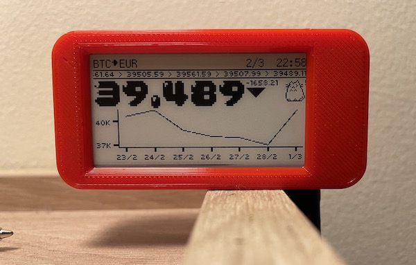
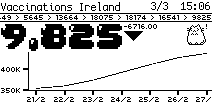
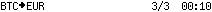
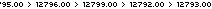
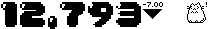
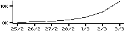
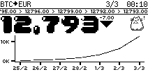

# InkyStock

A monochrome mini-display for stocks or cryptocurrency.



## Intro

InkyStock lets you display a stock or cryptocurrency value on a little **1-bit** display in a corner of your desk, or perhaps dangling from one of the many chandeliers in your crypto-billionaire prepper-palace in New Zealand.

### UI

#### Status Bar
Shows the coin, currency, and date/time the screen was last updated.
#### Ticker Bar
Shows recent price changes.
#### Headline
Shows the most recent price, its change since the last trading day, and a cat with a suitable level of concern/satisfaction depending on the direction.
#### Chart
Displaying the last 7 days of activity.

### Customizing
You can fairly easily customize some parts of the UI in `config.ini`; changing the mascot ( goodbye, pixelcat :< ), the fonts, etc.

For example:

| Happening           | Cat                                                       |
|---------------------|-----------------------------------------------------------|
| Price goes up       |       |
| Price goes down     |  |
| Market closed / no movement |  |

In crypto-land, however, *the market never closes*, so you'll probably never see sleeping cat. No rest for the proletariat!

These are controlled via these values in `config.ini`:

```ini
[Mascot]
increasing = ./resources/pixelcat/pixelcat_cool.png
decreasing = ./resources/pixelcat/pixelcat_worried.png
static = ./resources/pixelcat/pixelcat_sleeping.png
```

The important thing is that to display correctly, they need to be 1-bit images, and quite small (about 25x25 pixels). It's small enough that the images need to be designed for that resolution (pixel art). Resizing large images probably won't get you a result you'll be happy with.

[Brandon James Greer has a good introduction/tutorial to the concept](https://www.youtube.com/watch?v=0BZwEoj50uw) if you fancy trying your hand at it. Otherwise Google, Shutterstock, etc., are your friend!

It could be used for more than showing stock prices! It's got a basic UI framework, and can be modified to use other data.

For example, a simple swap out of stocks for COVID-19 vaccination data (see [resources/examples/vaccines.py](resources/examples/vaccines.py)):



## Disclaimer

I feel silly putting this disclaimer here, but:

**This project intended for entertainment purposes only.**

It is not intended to be investment advice. Seek a duly licensed professional for investment advice.

Just in case you were thinking of building a financial strategy based on a cat-meme hobby project 😅

It is also very much a work-in-progress / testing ground for things I wanted to play around with (like Pydantic, writing a layout engine, etc).


## Getting started

The hardware is fortunately very simple, and all just slots together, no soldering, etc. Not too many parts either:

 * [InkyPHAT eInk display](https://shop.pimoroni.com/products/inky-phat?variant=12549254938707)
 * [Raspberry Pi Zero WH](https://shop.pimoroni.com/products/raspberry-pi-zero-wh-with-pre-soldered-header)
 * Micro-B USB Cable (to connect to power supply)
 * A Pretty Case (Optional)

You can buy off the shelf Raspberry Pi Zero cases. The official one looks like it would work, and the InkyPHAT tutorial uses a [Pibow](https://shop.pimoroni.com/products/pibow-zero-w) case. If you have access to a 3D printer, [this is the case I've used (pictured above)](https://www.thingiverse.com/thing:4054844).

You might notice there are other InkyPHAT displays with more colors (yellow/red)! InkyStock should display correctly on those, too, though it will still just show as black and white.

Cryptocurrency data is sourced from [CoinGecko](https://www.coingecko.com/), who very helpfully provide a free API.

To display regular stocks, you'll need an [IEX Cloud](https://iexcloud.io/) API key. The free tier credits are enough to update the screen every 5 minutes, 24 hours a day. No credit card required. I'll accept pull requests for other providers, as long as they meet [the criteria](#adding-a-stock-provider).

### Install

You'll need to have SSH access to the Pi, and it will need access to the Internet. There are a variety of tutorials on doing that, [here's one](https://desertbot.io/blog/headless-pi-zero-w-wifi-setup-windows).

Assuming you're using the default `pi` user on Raspbian (Buster), SSH to the pi and run:

```bash
sudo apt-get install python3-pip python3-dev
wget -O inkystock.zip https://github.com/duggan/inkystock/archive/main.zip
unzip inkystock.zip
cd inkystock-develop
make install
```

Now you'll want to modify `config.ini` to suit, adding IEX Cloud API key information if you want to use it for stocks.

You can perform a test run by executing `./run.sh`. If it's set up correctly, you should see your screen updated within 10 seconds or so. If not, the error messages will hopefully be helpful enough to point you in the right direction.

When you're happy it's working, you can install a cron job to update the screen every 5 minutes:
```bash
sudo make cron
```

## Credits

* [Getting Started with Inky pHAT](https://learn.pimoroni.com/tutorial/sandyj/getting-started-with-inky-phat) is a good introduction to the basics.
* The 04B pixel fonts included are sourced from http://www.04.jp.org/
* [The Cozette font was developed by slavfox.](https://github.com/slavfox/Cozette)
* [Matt Brubeck's in-depth guide on writing a layout engine in Rust](https://limpet.net/mbrubeck/2014/08/08/toy-layout-engine-1.html) was a great reference guide.
* [José Fernando Costa's blog post on text sizing with PIL/Pillow](https://levelup.gitconnected.com/how-to-properly-calculate-text-size-in-pil-images-17a2cc6f51fd) was helpful with some head scratchers.
* Inspiration from [Pwnagotchi](https://github.com/evilsocket/pwnagotchi) and [inky-cryptochart](https://github.com/DurandA/inky-cryptochart).

## Developing

The project requires Python 3, and works with the version (3.7) present on Raspberry Pi OS (Raspbian).

Because the project dependencies rely on the `RPi.GPIO` library, it can't use the same set of dependencies for developing (unless you use a Raspberry Pi for development!). I use macOS, so there's a seperate `dev-requirements.txt` which is basically the `pip freeze` output of a working virtualenv.

### Structure

The entrypoint is `main.py`, which is where the providers and UI are tied together.

The main UI is set up in `ui.py`. This is a collection of objects that represent different sections, primarily: Status Bar, Ticker, Headline, and Chart.

Each of these sections is rendered and stitched together:









et voilá!



I started with a script with everything hardcoded, pixel positions, etc, then decided it would be nice if I could use something more like HTML/CSS to organize the data. Ultimately, I ended up using the project as a way to learn how to write a layout engine. The results are a bit rough, but if you want to try hacking away at it, a brief explanation follows.

The programming model is similar to rudimentary HTML/CSS, with sections composed of div-like boxes (`Container` objects) which have properties like `display`, `align`, `padding`, and `border`, that operate similarly.

`width` and `height` can be specified, but will default to the size the elements that are added.

```python
from inkystock.config import Config
from inkystock.paint import Pillow
from inkystock.layout import Container, Display, Align, Padding, Border

config = Config(path="./hello_world.ini")
painter = Pillow()

# an empty root container must be specified, attributes on this one are ignored.
root = Container()

# Add a container with desired attributes (1px padding, 1px border),
# display and align default to Display.BLOCK and Align.LEFT respectively.
hello_world = Container(display=Display.BLOCK,
                        align=Align.LEFT,
                        padding=Padding(top=2, left=2, bottom=2, right=2),
                        border=Border(top=1, left=1, bottom=1, right=1))

# Elements should be added via the painter.
hello_world.add(painter.text("Hello, world!",
                      font=config.fonts.statusbar,
                      font_size=config.fonts.statusbar_size))

root.add(hello_world)

```

The composed Containers are fed to a `Layout`, which can be handed to the `Painter` that does the actual mapping of instructions to pixels via PIL/Pillow.

```python
from inkystock.layout import Layout

layout = Layout(root).layout()

# The canvas size is specified here with the layout
image = painter.paint((hello_world.width(), hello_world.height()), layout)

# the image render() method returns a Pillow image, this can then be saved or manipulated
image.render().save("./hello_world.png")

# the display() method configures the InkyPHAT driver and sends the image to the screen
painter.display(image)
```


[Example code for hello world.](resources/examples)

As "hello worlds" go it's quite verbose, but it works fine when putting lots of things together. See `main.py` and `ui.py` for more.

### Adding a Stock Provider

A stock provider must provide both a current price quote, and historical prices.

If adding a third-party client, it should not pull in pandas or other large dependencies. I'd much prefer an implementation that just uses *requests* to interact with the relevant API endpoints.

Providers tried/rejected:

* **Alpha Vantage**: only supports historical data
* **Coindesk**: only supports Bitcoin