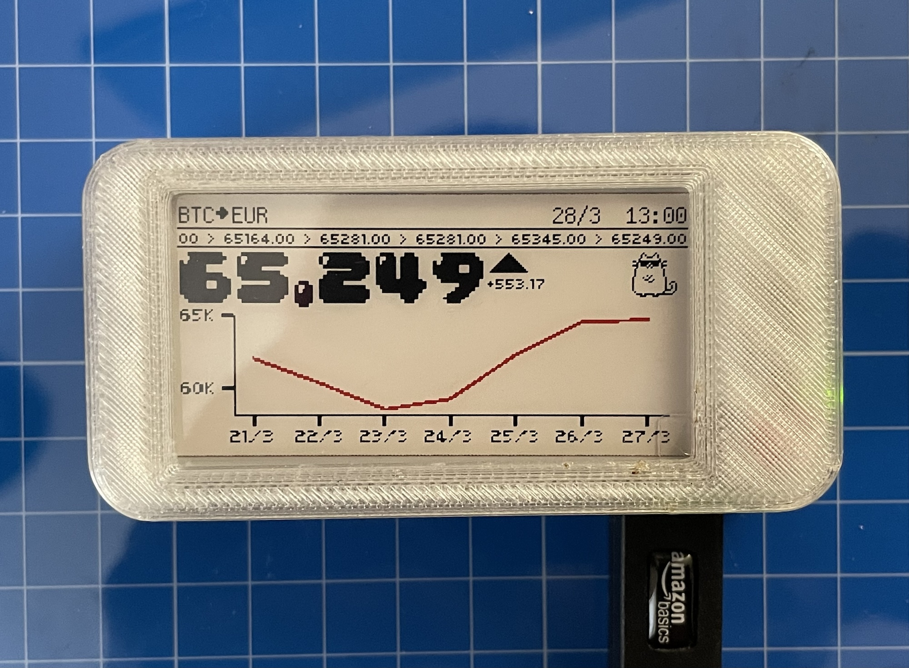
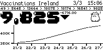
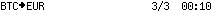
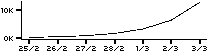
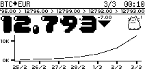

# InkyStock

A tiny, hackable, Raspberry Pi Zero powered e-ink display for cryptocurrency, stocks and more. Written in Python 🐍

Works with [Raspberry Pi OS (64-bit)](https://www.raspberrypi.com/software/operating-systems/), Raspberry Pi Zero 2W, and Inky pHAT Black & White, and Black, white and colour.

Full install last tested on **27th March, 2024**.



## Getting started

The hardware is fortunately very simple, and all just slots together, no soldering, etc. Not too many parts either:

- [InkyPHAT eInk display](https://shop.pimoroni.com/products/inky-phat?variant=12549254938707)
- [Raspberry Pi Zero WH](https://shop.pimoroni.com/products/raspberry-pi-zero-wh-with-pre-soldered-header) or Raspberry Pi Zero 2 (with headers).
- [microSD card](https://shop.pimoroni.com/products/noobs-32gb-microsd-card-3-1?variant=31703694245971)
- Micro-B USB Cable (to connect to power supply)
- A Pretty Case (Optional)

You can buy off the shelf Raspberry Pi Zero cases. The official one looks like it would work, and the InkyPHAT tutorial uses a [Pibow](https://shop.pimoroni.com/products/pibow-zero-w) case. If you have access to a 3D printer, [this is the case I've used (pictured above)](https://www.thingiverse.com/thing:4054844).

You might notice there are Inky pHAT displays with either color or black & white. InkyStock should display correctly on either, with the trend line in color on the color displays.

Cryptocurrency data is sourced from [Coinbase](https://www.coinbase.com/)'s public API — no account or API key required. Prices are fetched directly in your chosen currency.

To display regular stocks, data comes from [Yahoo Finance](https://finance.yahoo.com/)'s public chart endpoint — also no API key required. (This is an unofficial, best-effort endpoint, so it may rate-limit or change without notice.) I'll accept pull requests for other providers, as long as they meet [the criteria](#adding-a-stock-provider).

### Install

You'll need to have SSH access to the Pi, and it will need access to the Internet. There are a variety of tutorials on doing that, [here's one](https://desertbot.io/blog/headless-pi-zero-w-wifi-setup-windows).

Also, it's best to start with a freshly flashed OS; should help avoid any mysterious conflicts.

#### Quick install (recommended)

SSH to the Pi and run:

```bash
curl -fsSL https://raw.githubusercontent.com/duggan/inkystock/main/install.sh | sudo bash
```

This enables SPI/I2C, installs everything with [uv](https://docs.astral.sh/uv/), and starts InkyStock as a background `systemd` service. The default configuration needs **no API keys** — Bitcoin priced in EUR via Coinbase. Afterwards, edit `~/inkystock/config.ini` to change the currency, asset, or provider, then `sudo systemctl restart inkystock`.

To install a specific branch or tag instead (handy for testing a PR), point the same one-liner at that ref and pass it through:

```bash
curl -fsSL https://raw.githubusercontent.com/duggan/inkystock/<ref>/install.sh | sudo bash -s -- --ref <ref>
```

#### Manual install

Assuming you're using the default `pi` user on Raspbian (Buster), SSH to the pi:

Enable SPI and I2C:

```
sudo raspi-config nonint do_spi 0
sudo raspi-config nonint do_i2c 0
```

Install dependencies and app:

```bash
wget -O inkystock.zip https://github.com/duggan/inkystock/archive/main.zip
unzip inkystock.zip && mv inkystock-main inkystock
cd inkystock
sudo make deps
make install
```

The default configuration works out of the box with **no API keys** (Coinbase for crypto). You only need to edit `config.ini` to change the currency or asset, or to switch provider.

You can perform a test run by executing `./run.sh`, which performs a single update. If it's set up correctly, you should see your screen updated within a few seconds. If not, the error messages will hopefully be helpful enough to point you in the right direction.

If you see an error like the following:

> RuntimeError: No EEPROM detected! You must manually initialise your Inky board.

then it may be worth [trying the inky "one line installer" from the Pimoroni tutorial.](https://learn.pimoroni.com/tutorial/sandyj/getting-started-with-inky-phat)

When you're happy it's working, install it as a background service so it updates continuously:

```bash
sudo make service
```

This runs InkyStock as a `systemd` daemon, updating every 5 minutes. Because it stays running, it pays the Python startup and hardware-probe cost **once at boot** instead of on every update. Follow its logs with `journalctl -u inkystock -f`.

Alternatively, you can update via cron (a fresh process every 5 minutes):

```bash
sudo make cron.5m
```

## Configure

See the comments in `config.ini` for additional documentation of options.

### Crypto

The default configuration in `config.ini` will show the current price of one Bitcoin in Euro:

```ini
[Main]
currency = EUR
crypto = BTC
database = sqlite:///data/inkystock.db
provider = Coinbase

# Other config
...
```

Here you can change the currency or the cryptocurrency that will be tracked. History is tracked in an SQLite database.

### Stocks

To configure stocks, remove or comment out the `crypto` property and replace with `stock`, and update the provider details:

```ini
[Main]
currency = EUR
# crypto = BTC
stock = AAPL
database = sqlite:///data/inkystock.db
provider = Yahoo

# Other config
...
```

Stock data comes from Yahoo Finance's public endpoint — no API key required. Note this is an unofficial endpoint, so it's best-effort and may rate-limit or change without notice. Prices are converted to your configured currency using [ECB reference rates](https://frankfurter.dev) (also keyless).

## UI

### Status Bar

Shows the coin, currency, and date/time the screen was last updated.

### Ticker Bar

Shows recent price changes.

### Headline

Shows the most recent price, its change since the last trading day, and a cat with a suitable level of concern/satisfaction depending on the direction.

### Chart

Displaying the last 7 days of activity.

## Customizing

You can fairly easily customize some parts of the UI in `config.ini`; changing the mascot ( goodbye, pixelcat :< ), the fonts, etc.

For example:

| Happening                   | Cat                                                         |
| --------------------------- | ----------------------------------------------------------- |
| Price goes up               |         |
| Price goes down             |    |
| Market closed / no movement |  |

In crypto-land, however, _the market never closes_, so you'll probably never see sleeping cat. No rest for the proletariat!

These are controlled via these values in `config.ini`:

```ini
[Mascot]
increasing = ./resources/pixelcat/pixelcat_cool.png
decreasing = ./resources/pixelcat/pixelcat_worried.png
static = ./resources/pixelcat/pixelcat_sleeping.png
```

The important thing is that to display correctly, they need to be 1-bit images, and quite small (about 25x25 pixels). It's small enough that the images need to be designed for that resolution (pixel art). Resizing large images probably won't get you a result you'll be happy with.

[Brandon James Greer has a good introduction/tutorial to the concept](https://www.youtube.com/watch?v=0BZwEoj50uw) if you fancy trying your hand at it. Otherwise Google, Shutterstock, etc., are your friend!

It could be used for more than showing stock prices! It's got a basic UI framework, and can be modified to use other data.

For example, a simple swap out of stocks for COVID-19 vaccination data (see [resources/examples/vaccines.py](resources/examples/vaccines.py)):



## Credits

- [Getting Started with Inky pHAT](https://learn.pimoroni.com/tutorial/sandyj/getting-started-with-inky-phat) is a good introduction to the basics.
- The 04B pixel fonts included are sourced from http://www.04.jp.org/
- [The Cozette font was developed by slavfox.](https://github.com/slavfox/Cozette)
- [Matt Brubeck's in-depth guide on writing a layout engine in Rust](https://limpet.net/mbrubeck/2014/08/08/toy-layout-engine-1.html) was a great reference guide.
- [José Fernando Costa's blog post on text sizing with PIL/Pillow](https://levelup.gitconnected.com/how-to-properly-calculate-text-size-in-pil-images-17a2cc6f51fd) was helpful with some head scratchers.
- Inspiration from [Pwnagotchi](https://github.com/evilsocket/pwnagotchi) and [inky-cryptochart](https://github.com/DurandA/inky-cryptochart).

## Developing

The project requires Python 3, and works with the version (3.7) present on Raspberry Pi OS (Raspbian).

Because the project dependencies rely on the `RPi.GPIO` library, it can't use the same set of dependencies for developing (unless you use a Raspberry Pi for development!). I use macOS, so there's a seperate `dev-requirements.txt` which is basically the `pip freeze` output of a working virtualenv.

### Structure

The entrypoint is `main.py`, which is where the providers and UI are tied together.

The main UI is set up in `ui.py`. This is a collection of objects that represent different sections, primarily: Status Bar, Ticker, Headline, and Chart.

Each of these sections is rendered and stitched together:






et voilá!



I started with a script with everything hardcoded, pixel positions, etc, then decided it would be nice if I could use something more like HTML/CSS to organize the data. Ultimately, I ended up using the project as a way to learn how to write a layout engine. The results are a bit rough, but if you want to try hacking away at it, a brief explanation follows.

The programming model is similar to rudimentary HTML/CSS, with sections composed of div-like boxes (`Container` objects) which have properties like `display`, `align`, `padding`, and `border`, that operate similarly.

`width` and `height` can be specified, but will default to the size the elements that are added.

```python
from inkystock.config import Config
from inkystock.paint import Pillow
from inkystock.layout import Container, Display, Align, Padding, Border

config = Config(path="./hello_world.ini")
painter = Pillow()

# an empty root container must be specified, attributes on this one are ignored.
root = Container()

# Add a container with desired attributes (1px padding, 1px border),
# display and align default to Display.BLOCK and Align.LEFT respectively.
hello_world = Container(display=Display.BLOCK,
                        align=Align.LEFT,
                        padding=Padding(top=2, left=2, bottom=2, right=2),
                        border=Border(top=1, left=1, bottom=1, right=1))

# Elements should be added via the painter.
hello_world.add(painter.text("Hello, world!",
                      font=config.fonts.statusbar,
                      font_size=config.fonts.statusbar_size))

root.add(hello_world)

```

The composed Containers are fed to a `Layout`, which can be handed to the `Painter` that does the actual mapping of instructions to pixels via PIL/Pillow.

```python
from inkystock.layout import Layout

layout = Layout(root).layout()

# The canvas size is specified here with the layout
image = painter.paint((hello_world.width(), hello_world.height()), layout)

# the image render() method returns a Pillow image, this can then be saved or manipulated
image.render().save("./hello_world.png")

# the display() method configures the InkyPHAT driver and sends the image to the screen
painter.display(image)
```


[Example code for hello world.](resources/examples)

As "hello worlds" go it's quite verbose, but it works fine when putting lots of things together. See `main.py` and `ui.py` for more.

### Adding a Stock Provider

A stock provider must provide both a current price quote, and historical prices.

If adding a third-party client, it should not pull in pandas or other large dependencies. I'd much prefer an implementation that just uses _requests_ to interact with the relevant API endpoints.

Providers tried/rejected:

- **Alpha Vantage**: only supports historical data
- **Coindesk**: only supports Bitcoin

## Disclaimer

I feel silly putting this disclaimer here, but:

**This project intended for entertainment purposes only.**

It is not intended to be investment advice. Seek a duly licensed professional for investment advice.

Just in case you were thinking of building a financial strategy based on a cat-meme hobby project 😅

It is also very much a work-in-progress / testing ground for things I wanted to play around with (like Pydantic, writing a layout engine, etc).
